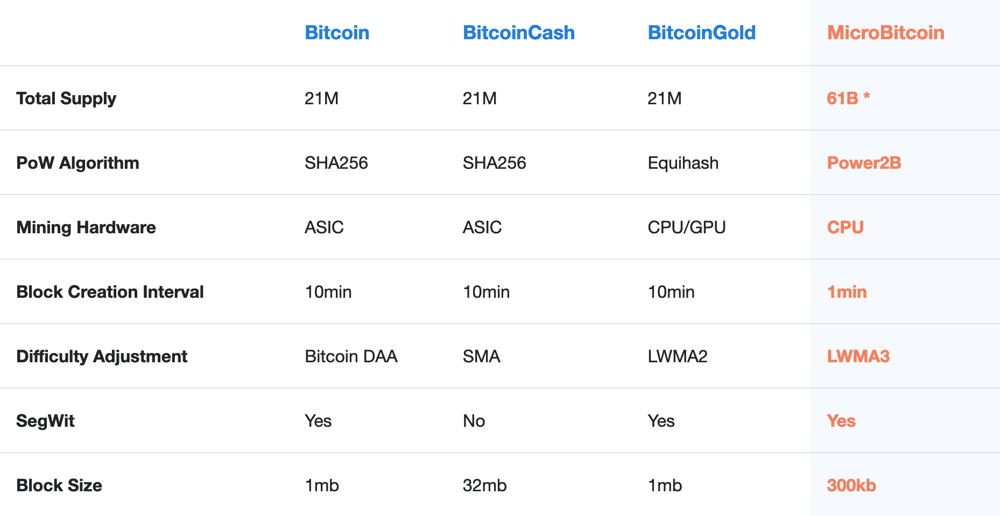

<h1 align="center">
	MicroBitcoin: decentralized peer-to-peer payment platform for the micro-economy<br>
</h1>

> **Abstract**. MicroBitcoin is decentralized blockchain intended to serve for micro-economy payments. It inherits Bitcoin UTXO set and initially has been implemented as an hard fork. After more than one year after launch some limitations began to arise, in particular extensive size of blockchain inherited from Bitcoin network and poor performance of PoW algorithm during block validation. To solve those issues on 9 October 2019 community switched to new network essentially abandoning old one. New MicroBitcoin network is featuring UTXO set snapshot, smaller block size, new block reward formula and cpu focused Proof-of-Work algorithm.

## 1. Prerequisites of new network launch

Initially original MicroBitcoin network has been launched 11 July 2018 as an hard fork of Bitcoin network. Main focus was on ASIC[1] resistance and faster block time to be more suitable for micro-payments. To make interaction with currency units easier decimal poin was shifted by 4 places making 1 BTC equal to 10,000 MBC.

First MicroBitcoin block was mined at 11 July 2018 causing hardfork by replacing default sha256d hash function with NIST SHA-3 candidate Groestl[2] algo which didn't had ASIC implementation at the time and because of that was considered ASIC resistant. Time proven that this assumption was wrong after Baikal released[3] BK-G28 featuring Groestl support on 26 October 2018. Since this time BK-G28 miners had been main source of hash power on MicroBitcoin network fundamentally corrupting decentralization. After extensive research we stopped on Rainforest[4] PoW algo by Bill Schneider. On 6 March 2019 MicroBitcoin network hardforked to Rainforest and on 7 May 2019 to second version of Rainforest (also known as RFv2) which fixed some flaws of original algo.

After a while it became clear that Rainforest v2 algorithm is way to slow during PoW validation phase and in combination with more than 200 GB of blockchain size make it very hard to sync/keep full node of MicroBitcoin essentially undermining decentralization. This situation became the main reason behind launch of new network.

## 2. Snapshot

Since MicroBitcoin network operates on UTXO[5] model where final address balance is basically sum of all unspent outputs, moving balances from one network to another is rather trivial task.

We took all UTXOs starting from block **525,000** (first MBC block) to block **1,137,200**, copied them and merged. For example if address had 3 unspent outputs in old network, they had been merged into one output with sum of amounts.

Example:


All snapshoted outputs is located in genesis[6] block of new MicroBitcoin network and can be checked in [explorer](https://microbitcoinorg.github.io/explorer/#/block/14c03ecf20edc9887fb98bf34b53809f063fc491e73f588961f764fac88ecbae).

## 3. Supply and emission

At the moment of new network launch total supply was over-minted for the current userbase, big chunk of funds haven't been moved since hard fork. To improve this situation coins which haven't been moved since block **525,000** (initial network launch height) hasn't been snapshoted and essentially burned. In total **44,386,397,362.4252** MBC has been activated. Approximately **2,700,000** BTC has moved since hard fork.

For better distributrion of new coins block emission schedule has been adjusted. Instead of halvings[7] which reduces block reward by 50% each 4 years new reward smoothly decrease each new block reward. Base reward is decaying by 30% each epoch which is around 2 years.

Graph for reward and mining supply:


Reward formula implementation in C++.

```c++
#include <iostream>
#include <cmath>

// Amounts of satoshit per coin
const int64_t COIN = 10000;

int64_t reward(int height) {
	// Initial reward per block
	const int64_t reward = 5500 * COIN;
	// Reward decreasing epoch (2 years)
	const int epoch = 525960 * 2;
	// Decrease amount by 30% each epoch
	const long double r = 1 + (std::log(1 - 0.3) / epoch);
	return reward * std::pow(r, height);
}
```

Total supply is limited to **61,000,000,000 MBC** from which **44,386,397,362.4252** MBC is snapshot amount from old network. The rest **16,613,602,638** MBC will be mined in around next 100 years.


## 4. Block size

To make network more reliable, prevent block spamming and create better and fair fee market in terms of 1 block per minute model block size has been decreased to **300kb**. Implementation is inspired by Bitcoin Core developer Luke Dashjr proposal[8].

## 5. Power2B Proof-of-Work algorithm

To encourage decentralization and idea of "one-CPU-one-vote" proposed[9] by Satoshi in original whitepaper of Bitcoin we used modified YesPower[10] hash function called Power2B[11] which was designed to be CPU-friendly, GPU-unfriendly, and FPGA/ASIC-neutral. It combines computationally expensive and sequential memory-hard hashing in a way that slows down GPUs to CPU-like speeds, and limits potential advantages for FPGAs and ASICs. So far YesPower proven to be decent CPU focused algorightm by providing security for dozens different cryptocurrencies.

Our Power2B modification replaces SHA256 based PBKDF2 and HMAC with blake2b[12] based implemetations in essence keeps YesPower original design intact. This has been done to make implemetations of FPGAs and ASICs for original YesPower incompatible with Power2B. This would require developers to create MicroBitcoin specific implementations of software/hardware and strengthening network security overall as an result.

## 6. Difficulty adjustment algorithm

MicroBitcoin network uses LWMA3[13] difficulty adjustment algorithm authored by zawy12. It sets difficulty by estimating current hashrate by the most recent difficulties and solvetimes. It divides the average difficulty by the Linearly Weighted Moving Average (LWMA) of the solvetimes. This gives it more weight to the more recent solvetimes. It is designed for small coin protection against timestamp manipulation and hash attacks. The basic equation is:

```
next_difficulty = average(Difficulties) * target_solvetime / LWMA(solvetimes)
```

## 7. Comparison to other Bitcoin hard forks

Here is table chart with comparison MicroBitcoin with other Bitcoin hard forks.



> Keep in mind that MicroBitcoin have **4** decimal places instead of **8** like in case of Bitcoin. So in terms of Satoshi units[14] supply of MicroBitcoin is only **3x** larger than supply of Bitcoin.

## 8. Future roadmap

This section outlines some plans and ideas about further development of MicroBitcoin protocol and ecosystem.

#### Alternative node implementation

To support network decentralization we will work on alternative network node implementations. This will strengthen the network and allow to prevent centralization around once specific implementations. Good example is Bitcoin Core[15] which is continuation of original Satoshi node implementation and btcd[16] which is written from scratch in Golang.

#### Software development kit and public API

Developers are very important part of community and to make their lifes easier we will create and publish MicroBitcoin SDKs for different languages like Node.js and Python. This would provide them simple and convenient way to interact with network.

Also it's inconvenient for developers to run full node that's why we will create fast and reliable public API with RESTful and Socket interfaces. It would provide some vital information like address balances, UTXO set, information about network and so on.  

#### Time lock contracts

Some real life agreements require collateral locked for some certain period of time. We will implement out of the box solution for creating such contracts using **OP_CHECKLOCKTIMEVERIFY**[17] opcode. It would allow lock MBC till specified timestamp or network height.

#### Lightweight wallets

To make use of MicroBitcoin network on daily basis for more accessibility we will create lightweight wallets for different platforms which not requires to store whole blockchain on your devices and utilize public API mentioned above for accessing UTXO set. Good example of lightweight wallet is mobile wallet which you always can have in your pocket :) 

---

### References

[1] https://en.bitcoin.it/wiki/ASIC  
[2] https://www.groestl.info  
[3] https://bitcointalk.org/index.php?topic=5057818.0  
[4] https://www.slideshare.net/bschn2/the-rainforest-algorithm  
[5] https://www.investopedia.com/terms/u/utxo.asp  
[6] https://en.bitcoin.it/wiki/Genesis_block  
[7] https://en.bitcoin.it/wiki/Controlled_supply  
[8] https://github.com/bitcoin/bitcoin/compare/v0.17.1...luke-jr:example_300k-0.17  
[9] https://bitcoin.org/bitcoin.pdf  
[10] https://www.openwall.com/yespower/  
[11] https://github.com/MicroBitcoinOrg/Power2B  
[12] https://blake2.net/  
[13] https://github.com/zawy12/difficulty-algorithms/issues/3  
[14] https://en.bitcoin.it/wiki/Satoshi_(unit)  
[15] https://bitcoincore.org/  
[16] https://github.com/btcsuite/btcd  
[17] https://github.com/bitcoin/bips/blob/master/bip-0065.mediawiki

### Links

Official Website: https://microbitcoin.org  
GitHub: https://github.com/MicroBitcoinOrg/  
Explorer: https://microbitcoinorg.github.io/explorer/#/  
Web Wallet: https://microbitcoinorg.github.io/wallet/#/  
API: https://api.mbc.wiki/
Discord: https://discord.gg/8zg2nTV  
Telegram: https://t.me/microbitcoinorg    
Twitter: https://twitter.com/MicroBitcoinOrg  
Forum: https://mbc.wiki  
BitcoinTalk: https://bitcointalk.org/index.php?topic=3982489.msg37769108  
Reddit: https://www.reddit.com/r/MicroBitcoinOrg/    
